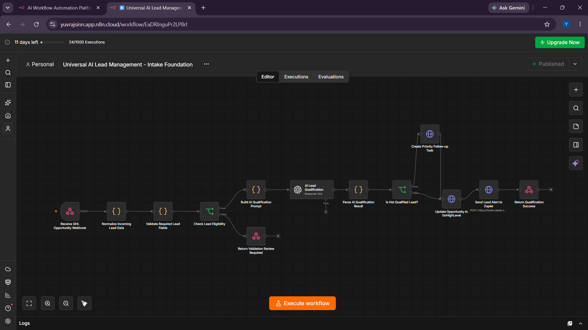
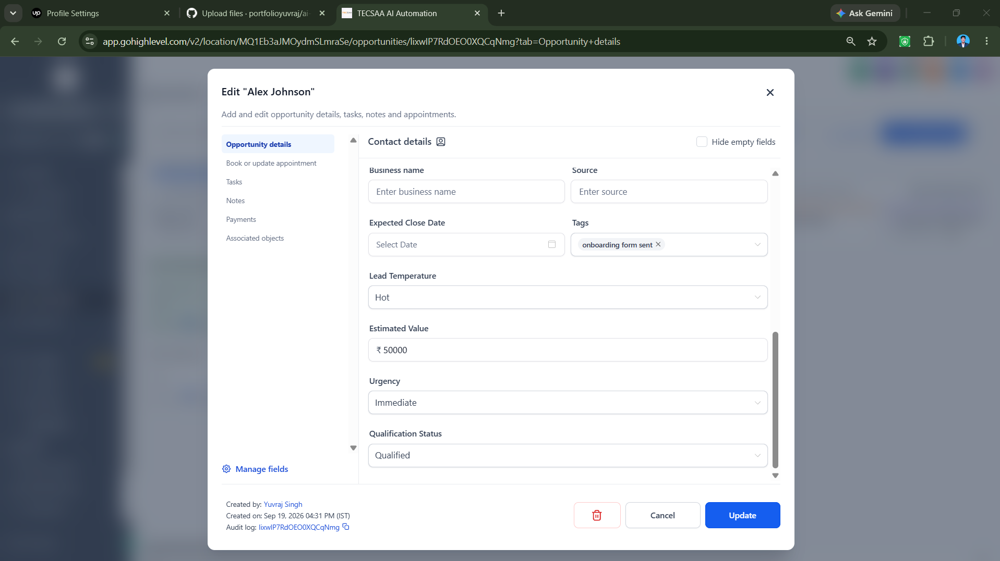

# AI Lead Qualification & CRM Automation

An AI-powered lead qualification workflow built with **GoHighLevel, n8n, OpenAI, Slack, webhooks, and REST APIs**.

## Business Problem

Sales teams often spend time manually reviewing leads, checking CRM details, deciding priority, and notifying the right person.

This workflow automates that process while keeping the sales team in control of final follow-up.

## What This System Does

1. Receives a new lead or opportunity event from GoHighLevel
2. Normalizes incoming CRM and custom-field data
3. Validates required contact details
4. Uses AI to classify the lead based only on the provided information
5. Generates:
   - Lead temperature: Hot, Warm, or Cold
   - Qualification status
   - Intent score
   - Timeline
   - Recommended next action
   - Evidence-based reason
6. Creates a priority follow-up task for Hot Qualified leads
7. Updates qualification details in GoHighLevel
8. Sends a real-time team alert through Slack
9. Returns a structured success response to the source workflow

## Workflow Architecture

```text
GoHighLevel
  → n8n Webhook
  → Data Normalization
  → Validation
  → OpenAI Lead Qualification
  → Qualification Parsing
  → Hot Lead Decision
  → Priority Task + CRM Update
  → Slack Alert
  ## Screenshots

### n8n Lead Qualification Workflow


### GoHighLevel AI Qualification Result

